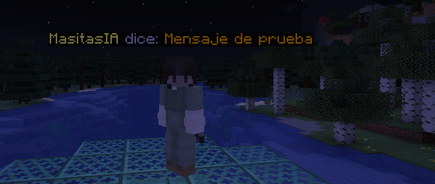

# 🎈 ChatGlobo



*El globo de texto se muestra al escribir cualquier texto mientras seas visible.*

**ChatGlobo** es un plugin moderno y ligero para servidores **PaperMC (1.21)** que muestra burbujas de texto flotantes sobre las cabezas de los jugadores cuando escriben en el chat.

Diseñado para mejorar la interacción social y el roleplay, utilizando las nuevas **Display Entities** de Minecraft para un rendimiento máximo sin lag.

---

## 📋 Compatibilidad

ChatGlobo utiliza tecnología moderna que no está disponible en versiones antiguas de Minecraft.

| Versión de Minecraft | Estado | ChatGlobo Recomendado |
| :--- | :--- | :--- |
| **1.21.x** | ✅ **Soportado** | Última Versión (v2.5.0+) |
| **1.20.x** | ⚠️ Experimental | v2.0.0 |
| **1.19.4 e inferiores** | ❌ No Soportado | N/A |

> **⚠️ Advertencia:** Este plugin requiere **PaperMC** (o forks como Purpur/Folia). **No funcionará en Spigot clásico ni en CraftBukkit.**

---

## ✨ Características Principales

* **🗣️ Automático e Inmersivo:** No necesitas comandos para hablar. Simplemente escribe en el chat y aparecerá el globo.
* **🎨 Soporte de Colores:** Compatible con códigos de color clásicos (`&a`, `&c`, `&l`, etc.) y formato de chat.
* **🚀 Rendimiento Optimizado:** Usa *Text Display Entities* (nativo de 1.21), lo que significa cero lag y movimientos suaves pegados al jugador.
* **📏 Altura Ajustable en Vivo:** ¿El globo está muy alto o muy bajo? ¡Cámbialo con un comando sin reiniciar!
* **💾 Persistencia de Datos:** El plugin recuerda tus configuraciones (quién ocultó el globo, la altura definida) incluso después de reiniciar el servidor.
* **🛡️ Control Total:** Comandos para administradores (apagado global) y para usuarios (apagado personal).

---

## 📥 Instalación

1.  Descarga el archivo `.jar` más reciente desde la pestaña de [**Releases**](https://github.com/MasitasIA/Globo-de-Chat-para-Minecraft-PaperMC/releases).
2.  Coloca el archivo en la carpeta `/plugins` de tu servidor.
3.  Reinicia el servidor o usa un gestor de plugins.
4.  ¡Listo! El archivo `config.yml` se generará automáticamente.

---

## 🎮 Comandos y Permisos

### Para Jugadores
| Comando | Descripción | Permiso |
| :--- | :--- | :--- |
| `/globo` | Activa o desactiva tus propios globos de texto. Útil si quieres ser discreto. | Ninguno |

### Para Administradores
| Comando                   | Descripción                                                          | Permiso |
|:--------------------------|:---------------------------------------------------------------------| :--- |
| `/globoglobal`            | Activa o desactiva el plugin para **todos** en el servidor.          | `chatglobo.admin` |
| `/globoaltura <n>`        | Define la altura del globo (ej. `0.625`). Se guarda automáticamente. | `chatglobo.admin` |
| `/globoclear`             | Borra todos los globos de textos en el mundo.                        | `chatglobo.admin` |
| `/globomute <jugador>`    | Mutea los globos de texto de un jugador.                             | `chatglobo.admin` |
| `/globotiempo <segundos>` | Define el tiempo que se muestran los globos de texto.                | `chatglobo.admin` |
| `/globoreload`            | Recarga las configuraciones del plugin.                              | `chatglobo.admin` |
| `/globodelay`             | Define el delay de aparición de los globos.                          | `chatglobo.admin` |
| `/globoidioma`            | Cambia el idioma del plugin <ES, EN, IT>.                            | `chatglobo.admin` |
---

## ⚙️ Configuración (`config.yml`)

El archivo `config.yml` se genera automáticamente. Aquí se guardan tus preferencias:

```yaml
# Configuración de ChatGlobo

# Idioma (es, en, it)
idioma: "es"

# Interruptor general del plugin (true = activado, false = desactivado)
global-activo: true

# Altura del globo sobre la cabeza del jugador (en bloques)
# 0.25 es ideal para estar pegado a la cabeza sin tocarla
altura-globo: 0.25

# Duración del globo en segundos antes de desaparecer
tiempo-vida: 5

# Duración de la animación de aparición/desaparición en ticks (20 ticks = 1 segundo)
ticks-aparicion: 1

# Lista de jugadores que tienen el globo desactivado personalmente
# (No toques esto manualmente, se llena solo con comandos)
usuarios-ocultos: []

# Lista de jugadores que están muteados y no pueden usar globos
# (No toques esto manualmente, se llena solo con comandos)
usuarios-muteados: []
```

---

## 🗣 Idiomas

Ahora el plugin viene con 3 configuraciones de idiomas incluidas, también permite modificar los archivos para mayor personalización

* **Español (ES)**
* **Inglés (EN)**
* **Italiano (IT)**

```yaml
# ==========================================
# Archivo de Idioma: Español (es)
# Plugin: ChatGlobo
# ==========================================

# El prefijo que aparece antes de cada mensaje del plugin
prefijo: "&8[&eChatGlobo&8] &r"

# Mensajes de error o advertencia
sin-permiso: "&cNo tienes permiso para usar este comando."
uso-delay: "&cUso: /globodelay <ticks> (20 ticks = 1 seg)"

# Mensajes de configuración (Administradores)
config-recargada: "&a✅ Configuración recargada correctamente."
globos-eliminados: "&a🎈 Eliminados %cantidad% globos."

# Variables de estado (Se usan dentro de globo-global)
estado-on: "&aON"
estado-off: "&cOFF"

# Mensajes de valores actualizados (Administradores)
globo-global: "🎈 Global: %estado%"
globo-altura: "&a🎈 Altura base: %altura%"
globo-tiempo: "&a🎈 Tiempo vida: %tiempo%s"
globo-delay: "&a🎈 Delay aparición: %ticks% ticks"

# Mensajes de moderación (Administradores)
jugador-desmuteado: "&a🎈 DESMUTEADO: %jugador%"
jugador-muteado: "&c🎈 MUTEADO: %jugador%"

# Mensajes personales (Jugadores)
globo-activado: "&a🎈 ACTIVADO."
globo-desactivado: "&e🎈 DESACTIVADO."

# Formato del globo de chat (El texto que va entre el nombre y el mensaje)
formato-dice: "&7 dice: "

# Lenguaje
uso-idioma: "&cUso: /globoidioma <es/en/it>"
idioma-cambiado: "&a✅ Idioma cambiado correctamente a: &e%idioma%"
```

---
Creado por **MasitasIA** - README hecho por Gemini.